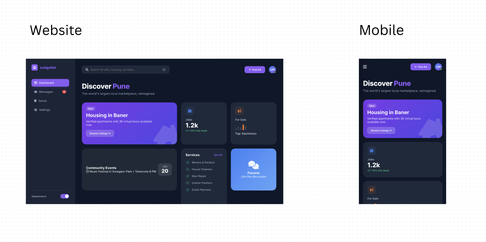

# CodTech-Task2-Responsive-Dashboard

# Name: Aditya Abnave
# Company: CODTECH IT SOLUTIONS
# ID: CTIS2512
# Domain: UI/UX Design
# Duration: 7 January 2026 to 4 February 2026
# Mentor: Neela Santhosh Kumar

## Overview of the Project

### Project: Responsive Web Dashboard Implementation
In Task 2, the objective was to translate design concepts into a fully functional, responsive web interface using HTML, CSS, and JavaScript. While Task 1 focused on the visual identity of the "Landing Page," this task shifts focus to the "User Dashboard"—the functional core of the platform where users manage their ads, messages, and settings.

### Objective
The goal was to build a "Glassmorphism" style dashboard that adapts seamlessly across devices. The interface prioritizes data density and utility (typical of a logged-in state) while maintaining a modern aesthetic. Key technical goals included:
1.  **Fluid Responsiveness:** Ensuring the layout transitions from a sidebar-based desktop view to a mobile-optimized stack.
2.  **State Management:** Implementing a functional "Dark Mode" that persists across sessions using LocalStorage.
3.  **Interactive Feedback:** Using JavaScript to provide immediate visual feedback (Toast Notifications) for user actions.

### Key Features
* **Responsive Sidebar Navigation:** On desktop, the sidebar is fixed and glass-morphic. On mobile (screens < 768px), it transforms into a hidden drawer accessible via a hamburger menu, maximizing screen real estate.
* **Complex Grid Layout:** The main content uses a CSS Grid "Bento" layout that intelligently rearranges cards based on viewport width (4 columns -> 2 columns -> 1 column).
* **Dark Mode Engine:** A custom theme switcher toggles CSS Variables for background, text, and surface colors, instantly flipping the UI from a clean "Day Mode" to a high-contrast "Night Mode."
* **Glassmorphism UI:** utilized `backdrop-filter: blur()` to create a premium frosted glass effect on the sidebar and cards, adding depth to the interface.

### Technology Stack
* **HTML5:** Semantic structure (using `<aside>`, `<main>`, `<header>`).
* **CSS3:** Extensive use of CSS Variables (`:root`), Flexbox, CSS Grid, and Media Queries.
* **JavaScript:** Vanilla JS for DOM manipulation, Event Listeners, and LocalStorage logic.
* **FontAwesome:** Vector icons for scalable, resolution-independent visuals.

### Conclusion
This project demonstrates the ability to implement complex UI patterns in code. By moving beyond simple static pages to a dynamic, theme-aware dashboard, the project highlights the bridge between aesthetic design and technical implementation. The result is a highly responsive, user-centric interface that functions flawlessly on any device.

## Output

